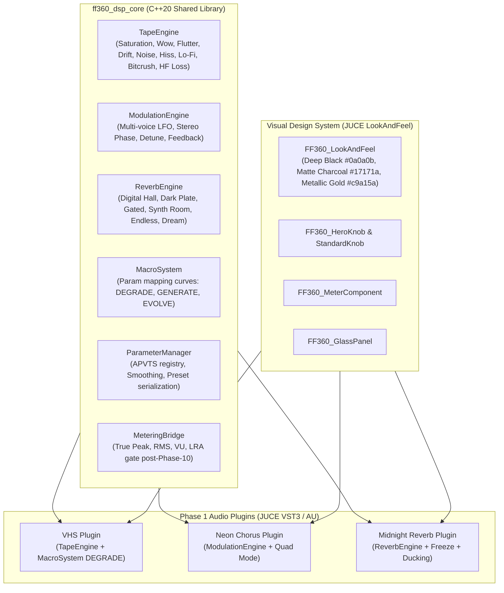

# ff360_labs Synthwave FX Suite — Phase 1: Core FX Implementation Plan

Phase 1 of the ff360_labs Synthwave Production Collection establishes the shared C++20 DSP core (`ff360_dsp_core`), the modular parameter and metering framework, the brand's glassmorphic UI design system, and three plugins:
1. **VHS** (Flagship tape degradation processor with DEGRADE macro)
2. **Neon Chorus** (80s stereo chorus with Vintage/Modern and Quad modes)
3. **Midnight Reverb** (Cinematic retro digital reverb with 6 algorithms, Freeze, and Ducking)

---

## Architecture Overview

