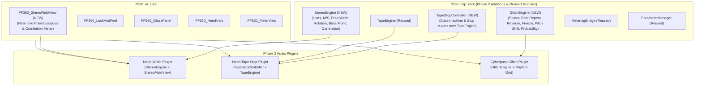

# ff360_labs Synthwave FX Suite — Phase 2: Creative FX Implementation Plan

Phase 2 builds upon the completed Phase 1 foundation (`ff360_dsp_core` and `ff360_ui_core`), adding two new DSP modules to the core library (`StereoEngine`, `GlitchEngine`), extending `TapeEngine` with the embeddable `TapeStopController`, and shipping three new creative plugins:
1. **Neon Width** (Stereo imaging & movement processor with real-time stereo field visualizer)
2. **Neon Tape Stop** (Musical tape stop with Vinyl, Tape, and Digital stop profiles)
3. **Cyberpunk Glitch** (Beat-synced rhythmic glitch, stutter, buffer freeze, reverse, and pitch shift)

---

## Architecture Overview

