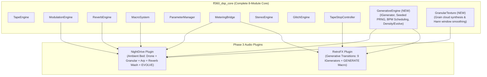

# ff360_labs Synthwave FX Suite — Phase 3: Generative FX Implementation Plan

Phase 3 is the final phase of the ff360_labs Synthwave Production Collection. It introduces `GenerativeEngine` and the `GranularTexture` engine to `ff360_dsp_core`, and ships the two generative plugins:
1. **RetroFX** (Generative synthwave transition and riser generator on demand with 9 generators + Hero GENERATE knob)
2. **NightDrive** (Generative ambient synthwave backdrop and drone bed engine + Hero EVOLVE knob + Chord/Scale Lock)

This phase concludes with a collection-wide audit and benchmark suite covering all 8 plugins in the suite.

---

## Architecture Overview

